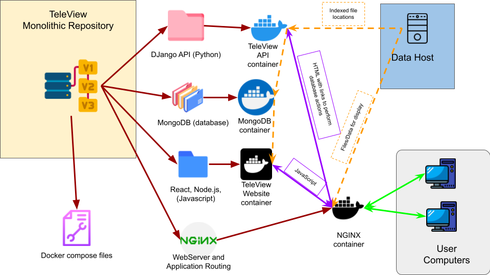
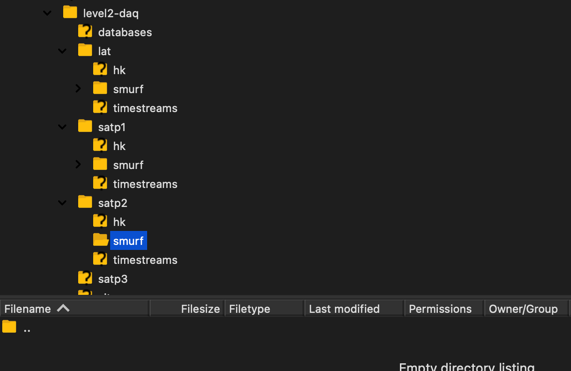

# TeleView
A Web Portal for viewing Simons Observatory data

The TeleView projects is a multi-language repository that is designed to operate four applications:

1. A Django Website that provides an interface to database actions written in Python
2. A MongoDB database that provides indexing and query capacities for a Host computers data file system(s).
3. A Next.js-React (JavaScript) front-end that provides a graphical user interface for viewing data.
4. An NGINX web server that provides a reverse proxy to the Django and Next.js-React applications as well as serving 
the static data files on the host computer.


Each application exists in a directory within the root TeleView folder.
Most applications can be run independently in a standalone mode for debugging and testing;
however, the applications are designed to run and be built together using Docker's compose.yaml files located in the
content root.

## Scope of this README.md

This README.md describes deployment of all applications together with Docker compose.
For information on testing or operating and individual applications, see the README.md file in that 
application's directory.

## TeleView Components Technologies Stack


## Why name it TeleView?

**TeleView** stands for **Tele**scope data **View**er.
In choosing this name I wanted a name that I
could easily type thousands of times, a name that was descriptive, and name that was memorable for people
that only use the application occasionally.
This is why the application sounds like "television";
This was amusing to me, and I made the favicon a black circle with yellow letters "tv" to give
the impression of a monochromatic cathode-ray tube.

# Initial Setup

TeleView is designed to work on any computer that is running Docker.
It will properly disturb my users, but this application was developed on a Windows 10 machine,
using Docker Desktop for Windows, and the Windows Subsystem for Linux (WSL2).
TeleView gets test on a Mac and is deployed on a Linux server.
It should work on any computer that is running Docker.

## Environment Variables

TeleView uses environment variables to configure the applications.
These are found in a .env file in the root directly of this project.

> [!WARNING]
> The .env file is not included in the git repository and is ignored by git.
> This is because the .env file contains sensitive information.

### Initial Setup
Copy the .env-default file (in the root of the TeleView repository)
to .env and edit the values to match your system.

The tvapp requires a special file named .env.production. See the 
/tvapp/.env.production.example to see what this file should look like.
Use the convince script init.sh to automatically copy the relevant
variables from the root .env file to the tvapp/.env.production file.

The .env is a central location for a configuration distribution across
the TeleView applications. This file is expected and used by docker-compose,
see the compose.yaml file in the root of the TeleView repository.
The compose.yaml file distributes these variables to the applications,
and each application has its own way of using these variables.

Some variables are used by all applications, some are used by only one,
some are used only during the application build process, some are used
only the first time, and the application is run, while others can be changed
when the application started at run-time. 
Find more on this in section "All the rest of the environment variables" below.

### Pointing to data
The most important environment variable points to the data.
```
- TELEVIEW_PLATFORMS_DATA_DIR=/data_path/to_one_or_more_telescopes/
```
Edit this value in the .env file.

> [!NOTE]
> This can be an absolute or relative path on the Host computer.

This is a directory that should contain one or more folders meant to represent
physically separated systems (different telescopes).

Each telescope folder should contain a folder named `smurf` that contains the data files.
In the future, it is our intention expanded to include other data types with diniated by
different folder names. For now, the only folder that is used is `smurf`. 
If the data directory is missing or empty, the application will not identify that directory as a *platform*
and any datafiles will not be indexed/available in the database.

> [!NOTE]
> **platform** is an important term in TeleView, and indicates an
> indexed data attribute used for filtering and returning data.


Caption: The directory structure. In the image example above, `TELEVIEW_PLATFORMS_DATA_DIR=/so/level2-daq/` While this directory has
multiple subdirectories, only the **lat** and **satp1** directories are indexed as a platforms. The other directories
are either missing the expected data directory (only *smurf* is allowed at the time of writing) or their
smurf directory is empty, as is the case for **satp2** in this example.

### Configuring the Website Host

The TeleView website is hard-coded to be served from a sub-directory 
of the host computer's web server. So if the host name is anywebsite.com,
then the TeleView website will be served from anywebsite.com/teleview/.
If you need to change this, I am sorry, but you will need to find and replace
the string "teleview" in the code, not an easy task for a repo named teleview.

However, you can configure the hostname and port number by configuring the
.env file.

To test on your local computer, I like to use the following values:
```
TELEVIEW_LOCALHOST_PORT=8111
TELEVIEW_PUBLIC_SITE_HOST=http://localhost:8111
```

The Port '8111' is less likely to be used by other applications, 
but it means you will need to append this number to the host name.

If you only develop one website at a time on your local computer, you can 
use port 80, which is the default port for http web traffic. This allows
you to omit the port number from the URL.

```
TELEVIEW_LOCALHOST_PORT=80
TELEVIEW_PUBLIC_SITE_HOST=http://localhost
```

For TeleView server deployment, you will need to add and extra layer of
routing to the NGINX configuration to route to port 443 (https) to port 80 (http).
and to serve and verify SSL certificates. For the site computer, this
is handled by a separate NGINX server that is not part of the TeleView.
That configuration looks like this:

```
TELEVIEW_LOCALHOST_PORT=8111
TELEVIEW_PUBLIC_SITE_HOST=https://site.simonsobs.org/
```

### All the rest of the environment variables

Run-time variables can be used to configure the applications
when using `docker compose up` to initial the container network.


```
TELEVIEW_VERBOSE=0
TELEVIEW_DEBUG=1
TELEVIEW_MONGODB_PORT=27017 
TELEVIEW_MONGODB_HOST="mongodb"
TELEVIEW_DEFAULT_ITEMS_PER_PAGE=200  # tvapp only
```

Some variables are needed at docker images build-time and are used
in the Dockerfile for a given application. The following variables are used only
in the tvapi (Django) application. You can see here that a root user is
created for the admin access to the tvapi at container build-time, and these secrets
are not exposed to the container at run-time.


```
DJANGO_SUPERUSER_USERNAME="root"
DJANGO_SUPERUSER_PASSWORD="I8pi4fun!"
DJANGO_SUPERUSER_EMAIL="chw3k5@gmail.com"
```

There are other variables that are used the first time an application is built.
This is true for the MongoDB image. The following variables are used
to create a root user for the MongoDB database. It should be noted that these
are run time variables that are needed by both tvapp and tvapi applications
to log in to the MongoDB database.

```
TELEVIEW_MONGODB_ROOT_USERNAME=user
TELEVIEW_MONGODB_ROOT_PASSWORD=pass
```


#### Setting up the docker environment 

## Docker, a few tips
Helping install Docker is beyond the scope of this README.md. Here is the link, https://docs.docker.com/engine/install/,
it is a little different in every operating system.

If you are going to work on this or any project that uses Docker, you may want to configure
your system to start docker when the system starts. 

> [!WARNING] 
> TeleView is set to start when Docker starts, it has the container `restart-policy` set to "always".
> This is the desired behavior for a production system, but it can be annoying when developing.

> [!NOTE]
> If you are developing this application, remember to clear the cache periodically so as not to
> overload your disk storage.
> `docker system prune --force --all` is a good command to know when
> starting your Docker journey.

> [!NOTE]
> It is the docker server that is required to be running. Most of the time that
> my docker commands fail it is because I forgot to start the docker server. 
> To see if the docker-server is running,
> open a terminal and type `docker version`, you should see both **Client** and **Server** version information.

> [!Warning]
> For running scripts with docker commands. In Linux all docker commands need a `sudo` prefix,
> in macOS and Windows, using `sudo` is a mistake for docker. If you are running my TeleView scripts
> that contain docker commands, you will need to run the script with `sudo` if you are a Linux user.
> If you are on the site computer, you will not be able to run the scripts as general `sudo` usage is restricted.

## The first build

Before calling the first `docker compose build` command it is necessary to create
a special file named .env.production. See the
/tvapp/.env.production.example to see what this file should look like.
Use the convince script init.sh to automatically copy the relevant
variables from the root .env file to the tvapp/.env.production file.

You will need to run the init.sh script everytime you change the .env file
variables that are used by the tvapp application. This is good reason to
eliminate the need for the .env.production file, but that was not done at
the time of writing.

## The first run

The first time the TeleView system is run from a `docker compose up` command,
The MongoDB database will be initialized with a root user and password.
The database initialization creates a number of files in the `./mongo` directory.
This directory is empty when the TeleView repository is cloned from GitHub,
and only includes a single .gitingore that instructs git to ignore all files in the mongo directory.

## Subsequent builds
You can always use the top level convince script `build.sh` to 

1. build all the images
2. stop all running containers,
3. remove the shared volumes
4. call the init.sh script to refresh the .env.production file from the current
.env file
5. deploy a test application on the localhost
6. tag the images with the current git commit hash and project version number, 
7. push the images to the GitHub container repo.

I use the script and then call control-C to stop when issue to exit the
script if I see issues.

Of course, you may find yourself on a Lennox machine where you do not have sudo access
needed to run docker commands in a script. Maybe you are good at remembering  
accurately typing a number of docker commands, and you want to look cool
like the hackers shown in movies. See the following section for a list of
docker commands that you can run manually.

## Docker commands

On Windows, there is no sudo. 
On Linux, you will need to use sudo for all docker commands.
On Mac, Docker gets mad at you if you use sudo. 

### Is docker on?

See is the Docker **serve** (daemon) is running (not *just* the client)

```
docker version
```

### To stop the running containers and remove the shared volumes

It is important to add the `-v` option to remove the shared volumes,
otherwise the files in these volumes will persist and be used the next time
instead of new files being created at docker image build time.

```
docker compose down -v
```

### To build the images

It should be noted that the build command can be run before calling the down command.
I do the have the least amount of downtime for the TeleView website.
I like the order of build, down, then up.


```
docker compose build
```

During development on my local machine, when downtime is not an issue,
I will often use the following command to build the images and start the containers.
at the same time. This is not recommended for production.

```
docker compose up --build
```

### To start the containers

In production, the final command I call to start the containers also adds the
`-d` option to run the containers in the background. This way I can close the
terminal and the containers will continue to run.

```
docker compose up -d
```

In development, I do not use the `-d` option so that I can see the output
from the containers in the terminal and use control-C to stop the containers.

```
docker compose up
```

### Login to the GitHub container registry

The TeleView images can be built then pushed to (pulled from) the GitHub container repository.
To log in to the GitHub container registry, use the following command:

```
docker login ghcr.io
```

### Tag the images

I could not find a good way to tag the images using the compose.yaml file.
It only allowed for one tag, and I wanted to use that to indicate the
`LATEST` tag.

So I wrote a small script to tag the images with the `docker tag` command.
Call this script from the root of the TeleView repository.
This tags the images with the current version number and the current
git commit hash.

```
./scripts/tag-images.sh
```

### Push the images to the GitHub container registry

The TeleView images can be built then pushed to (pulled from) the GitHub container repository.
To push the images to the GitHub container registry, use the following command:

```
docker compose push
```

### To pull the images from the GitHub container registry

```
docker compose pull
```