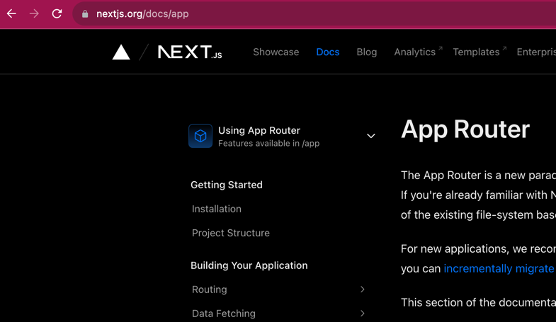

# React front-end for TeleView Data Portal

This directory contains the files for creating viewable webpages and URL views to 
provide a Graphical User Interface for viewing telescope data.

## Frameworks and Paradigms

### 0. JavaScript, TypeScript, React, and NEXT.js

> [!NOTE] 
> JavaScript has nothing to do with Java; it is a completely different language. JavaSript was a name chosen to 
> make a marketing connection to the popular Java language.

> [!NOTE]
> [Trasnpiling](https://stackoverflow.com/questions/44931479/compiling-vs-transpiling) 
> is the process of converting code from one language to another.

The code that we write in the TeleView project is not what is run on the 
client's browser. The TeleView code goes through several layers of computation.
Webpack is used to bundle the code into a single file. Babble is used to
convert the code into a version of JavaScript that is compatible with
the client's browser. This is called transpiling. TypeScript is a language
that is a superset of JavaScript. TypeScript is used to write the code
in the TeleView project. After a type-checking phase, 
TypeScript is transpiled into JavaScript. React is a JavaScript library,
to write functional components in JavaScript, while still using 
state-variables, DOM manipulation, and other class-like features of React.
Code written in React is transpiled into JavaScript.
NEXT.js is a React framework that allows for server-side rendering of webpages.

All of this works because of extra rules that are added at each layer.
TeleView is designed to use the strictest set of rules at each layer with
the intention that this will make the code more reliable and easier to maintain.


### 1. Use of the `app` directory paradigm for the NEXT.js project.

The `app` directory router is a way of organizing the files in a project. 
Setting up the `app` directory was the newer and recommended structure a
NEXT.js project at in 2023. It was the hope to the author that this would
make it easier to add new features to the project over its lifetime.

Understanding that there are two paradigms for NEXT.js projects is important
to navigating the NEXT.js docs: https://nextjs.org/docs/app. The app router
was new enough that when this project was started, the NEXT.js book I bought,
published in 2022, did not cover the app router. This led to a lot of
confusion and wasted time. The `app` router replaces a and simplified a lot
of redundant code that was required in the `pages` paradigm.

Look for the blue cube in the NEXT.js docs to know if the docs are for the
`app` router or the `pages` router. The blue cube is the logo for the `app`.
See the image below.



If you know the other NEXT.js router, the `pages` directory, and want to learn 
about the changes to the `app` paradigm, you can read about it here:
https://blog.logrocket.com/next-js-13-app-directory/.


### 2. React components written in the `TypeScript` language.

TypeScript is a way of writing javascript that requires strict typing of variables.
It can make a project hard to initially set up.
However, it makes adding complex features more reliable and easier to maintain. 

React is a JavaScript library for building user interfaces.
Developers can trigger changes to the user interface by changing 
the state various of the application. This is the *react*ive component.
React allows you to write in pure TypeScript/Javascript, but it also
allows you to write in TSX/JSX, which is a combination of HTML and JavaScript.
Most of the code in this project is written in TSX format as denoted by the
`.tsx` file extension.

React has moved away from class-based components to functional components,
with `hooks`. Hooks allow you to make use of state and other features
of React without having to write a class. In the tvapp, all components
have the same general layout: 

a. States and hooks at the top of the function body

b. Logic, analysis, and calculations in the middle of the function body.

c. Layout of the component with TSX/HTML at the bottom of the function body
at the `return` statement. Note that TSX/HTML elements will have a `className`
attribute instead of a `class` attribute. This is because `class` is a reserved
word in TypeScript.

NEXT.js is a React framework. This framework extends React to allow for
more features and complex configiration. The main benefit to using NEXT.js
for this project is that it allows for server-side rendering (SSR) 
of the webpages. This means that the webpages can be rendered on the server.
While this has many uses, we use this feature to query the MongoDB server
without the need for a REST API. This is because the NEXT.js server
can query the MongoDB server directly, but only in the SSR components.

Server-side query and rendering allow for a major speedup in the loading of webpages that
are generated on a remote mountain in Chile. Here we skip the step of loading
the webpages on the client's computer, then going back to the server to query
the database. Instead, we query the database on the server, then send the
rendered webpage and data to the client.


### 3. Configurations for `Tailwind CSS` were selected.

CSS is a language for styling HTML elements. It is used to make webpages
look nice. Tailwind CSS is a CSS framework that allows you to write CSS
in a more efficient way. The main benefit of Tailwind CSS is that styling
takes place in the HTML-like TSX/JSX react code. Styling is for and element
readable in the same location as the element, not imported from a separate 
CSS file(s). This was chosen to make it simpler to copy and paste elements
and then modify the new element to be visually distinct.

Visit to https://tailwindcss.com/ to read the pitch for Tailwind CSS.

I found the docs to be really well written with everything I needed to know
available in simple examples. See the link for the how to use 
a **flex** CSS attribute https://tailwindcss.com/docs/flex as an example.
Sometimes I would want a more complected example, and I would try to find
it on Stack Overflow. However, 90% I would end up back at the 
Tailwind CSS docs with a better understanding of what I was trying to do;
and then be able to make a complex component from fundamental Tailwind CSS.


## Intentions and Scope

The tvapp is a NEXT.js web application; a part of the TeleView project.
The Teleview project has been designed to run in Docker containers.
This was chosen to simplify the installation, deployment, and maintenance 
of the TeleView project.

While it is possible to run tvapp outside of Docker, on a local machine,
it is not the design **intention** of the TeleView project. This application
depends on a connection to the Teleview's MongoDB server. To eliminate
docker, simple take all the systems networked be docker and run then
on the host machine. However, it is recommended to use Docker so as 
not to burden developers with manually setting up ports,
bringing multiple services up and down, installing dependencies, or
distributing shared variables and files.

The **scope** of this README.md is to provide instructions for running
the development environment for the tvapp. The development environment
runs locally on the host machine, outside of Docker. However,
this environment uses the MongoDB server that is expected to be running
in a docker container.

# The Development Environment

**Why use a development environment when docker runs the production environment
so easily?** 

The development environment can reload code changes very quickly, and without
the users running any additional commands. This is very useful when developing
something totally new to guess-and-check what is allowed and what is not.
This is also useful when making small changes to the code, such as changing
the color of a button.

The development environment is less strict, things that would fail during
the projection build will raise a helpful warning in the development environment.

I regularly use the development environment to develop new features, and
then I try to check and test the new code in the docker production environment
before committing the code to the repository.

## Starting the MongoDB server

[!WARNING]
> The Teleview sevices may allready be running. If so, you can skip this section.
> This is because the deployed TeleView project runs in Docker containers
> that have a restart-policy: *always*. This means that the TeleView services will
> be running if the images are built when Docker starts. If you are not sure
> if the TeleView services are running, you can run the command
> ```docker ps```, which will list all running containers.
> Windows and Mac users can also use the Docker Desktop GUI. 

The MongoDB server is expected to be running in a docker container, although
there is no reason why it cannot be running on the host machine directly.

To run MongoDB for TeleView follow the instructions in the README.md file
at the root of the TeleView project. In short, this is a single command

```docker compose up --build```

This requires that you have the tvapp, tvapi, and MongoDB services setup
and stable. While you may not be looking at the dockerized tvapp,
it will need to be stable for the other docker services to start correctly
using the `docker compose` command.

If you need to bring the MongoDB server down, you can use the command

```docker compose down -v```

If you have made any changes to the teleview repository, then you may
not be able to run the MongoDB server with the `--build` option.
In this case, you can run the command

```docker compose up```

This brings up that last known stable version of the MongoDB server,
(and other services) without rebuilding the docker images.

[!NOTE]
> The MongoDB server is expected to be found on port 27017 on the host machine.
> This port is configurable in TeleView, but the default port used by TeleView
> is the default port for MongoDB.
 
[!NOTE]
> You can view the MongoDB server using the Compass GUI for MongoDB.
> https://www.mongodb.com/products/tools/compass


## Installation outside of Docker

### What was used to initalize the NEXT.js tvapp?

This is a [Next.js](https://nextjs.org/) project bootstrapped with [`create-next-app`](https://github.com/vercel/next.js/tree/canary/packages/create-next-app).
At the time installation, all the default options were selected:

1. Use of the `app` directory paradigm for the NEXT.js project.
2. Use of the `TypeScript` language.
3. Configurations for `Tailwind CSS` were selected.

### Getting Started

With Node.js installed, you can use the `npm` command.

Make sure you are in the `Teleview/tvapp/` directory, the same directory that contains 
this README.md file.

Then, run the development server:

```bash
npm run dev
```

Open [http://localhost:3000](http://localhost:3000) with your browser to see the result.

You can start editing the page by modifying `app/page.tsx`. The page auto-updates as you edit the file.

This project uses [`next/font`](https://nextjs.org/docs/basic-features/font-optimization) to automatically optimize and load Inter, a custom Google Font.

### Learn More

To learn more about Next.js, take a look at the following resources:

- [Next.js Documentation](https://nextjs.org/docs) - learn about Next.js features and API.
- [Learn Next.js](https://nextjs.org/learn) - an interactive Next.js tutorial.

You can check out [the Next.js GitHub repository](https://github.com/vercel/next.js/) - your feedback and contributions are welcome!


# Migrating to the Deployment Environment

Sometimes docker can fail to build the development environment after seeming
to work fine in the development environment. If you have read this far,
then you are probably stuck.

## Run the failing docker image outside of `docker compose`

Concentrate only one the failing image. In the tvapp directory run the command

```docker build -t tvapp .```

## Check the production environment

NEXT.JS does not allow environment variables except by passing them in a
.env files, specifically the .evn.production file for the docker build. 
This file is not in the repository because it contains sensitive information.
However, you can see an example of the .env.production file in the
tvapp/.env.production.example file.

This file is a subset of the .evn file in the root directly and can be made
by running the ./init.sh script in the root directory.

> [!WARNING]
> It is known that the daq-site computer cannot create this file correctly
> using init.sh. It adds extra return characters (`^M`) near the ends of each
> line in the file. [Github Issue #23](https://github.com/simonsobs/TeleView/issues/23)


